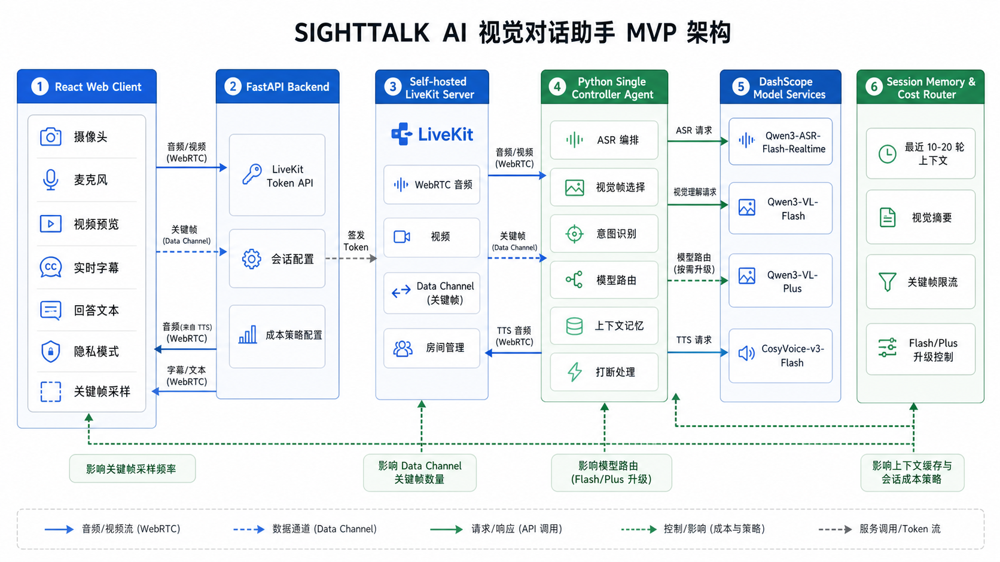

# SightTalk AI 架构设计文档

## 1. 文档信息

| 项目 | 内容 |
| --- | --- |
| 产品 | SightTalk AI |
| 文档类型 | 架构设计 |
| 版本 | v0.1 |
| 日期 | 2026-06-12 |
| 范围 | 视觉对话助手 MVP |
| 原则 | 低延迟、低成本、可替换模型、隐私边界清晰 |

## 2. 架构目标

MVP 架构服务于一个核心闭环：用户在浏览器中打开摄像头和麦克风，对准现实画面提问，AI 基于当前画面和语音意图回答，并用语音播报。

本阶段优先解决：

- 浏览器实时音视频采集和播放。
- 后端安全签发 LiveKit Token。
- Agent 订阅音频、接收关键帧、调用 ASR/VLM/TTS。
- 短期上下文、视觉摘要和成本路由。
- 隐私模式、打断、模糊画面不编造。

不在 MVP 中解决长期记忆、多 Agent 协作、移动端原生、复杂本地视觉模型和商业化后台。

## 3. GitHub 调研结论

调研时间：2026-06-12。以下结论用于架构选型，不代表这些项目后续状态不会变化。

| 项目 | 观察 | 对 SightTalk AI 的启发 |
| --- | --- | --- |
| [livekit/agents](https://github.com/livekit/agents) | LiveKit Agents 将 Python 或 Node.js 程序作为实时房间参与者，处理媒体和数据并发布结果。 | 适合把 AI Worker 作为 LiveKit 房间中的一等参与者，减少自研媒体编排。 |
| [livekit-examples/agent-starter-python](https://github.com/livekit-examples/agent-starter-python) | 官方 Python Starter 覆盖语音 AI、测试评估、观测和 Docker 部署。 | Agent Worker 可从 Python 模板演进，后续补充评估和观测。 |
| [livekit-examples/agent-starter-react](https://github.com/livekit-examples/agent-starter-react) | 官方 React Starter 提供语音、转写、摄像头、媒体控制等 UI 模式。 | 当前仓库使用 React + Vite，不直接迁移 Next.js，但可借鉴 LiveKit React 组件和交互结构。 |
| [livekit-examples/vision-demo](https://github.com/livekit-examples/vision-demo) | 示例展示实时音频和视频输入，由 LiveKit Python Agents 与 Gemini Live API 组成后端 Agent。 | 证明“前端实时媒体 + Agent 视觉理解”的产品形态可行。 |
| [pipecat-ai/pipecat](https://github.com/pipecat-ai/pipecat) | Pipecat 是实时语音和多模态 Agent Python 框架，强调可组合 pipeline、多 Agent 和多传输协议。 | 是强替代方案；当后续需要复杂 pipeline、多 Agent 或跨传输协议时可重新评估。 |
| [GetStream/Vision-Agents](https://github.com/GetStream/Vision-Agents) | Stream 的 Vision Agents 面向低延迟视觉 AI，强调 WebRTC、视觉 pipeline 和多模型集成。 | 说明“视频帧 + 语音 + Agent”的需求普遍存在，可借鉴视觉帧处理和模型抽象。 |
| [AliZaiN-157/Cloudy-An-Voice-AI-assistant-for-AWS](https://github.com/AliZaiN-157/Cloudy-An-Voice-AI-assistant-for-AWS) | Cloudy 使用 React、LiveKit、FastAPI 和 Gemini，支持实时语音、屏幕共享和多模态交互。 | 与本项目技术形态接近，验证 React + FastAPI + LiveKit 的组合可作为 MVP 基线。 |

总体结论：SightTalk AI 的 MVP 更适合基于 LiveKit + LiveKit Agents 构建，而不是从纯 WebSocket 或更复杂的 pipeline 框架起步。原因是当前目标首先是稳定打通浏览器实时音视频、Agent 订阅与发布、房间权限和数据通道，而 LiveKit 已经提供这些基础能力。

## 4. 技术选型

| 层级 | 选型 | 说明 |
| --- | --- | --- |
| 前端 | React + Vite + TypeScript + LiveKit React Components | 与当前仓库一致；用 LiveKit 组件承接房间连接、媒体轨道和控制栏能力。 |
| 后端 API | FastAPI + Pydantic Settings + uv | 与当前后端栈一致；负责配置、健康检查和 LiveKit Token 签发。 |
| 实时媒体 | Self-hosted LiveKit Server | 承载 WebRTC 音频、视频、Data Channel 和房间管理；个人项目可先自托管控制成本。 |
| Agent Worker | Python LiveKit Agents | 作为房间参与者订阅用户音频和数据通道，发布 TTS 音频和文本事件。 |
| ASR | DashScope `qwen3-asr-flash-realtime` | 用于实时语音识别；阿里云文档将其列为 Qwen-ASR 实时 WebSocket 模型。 |
| VLM | DashScope `qwen3-vl-flash` 默认，`qwen3-vl-plus` 受控升级 | Flash 作为默认低成本视觉理解模型；Plus 仅在策略允许时升级。 |
| TTS | DashScope `cosyvoice-v3-flash` | 用于低延迟语音合成；播报必须支持被打断。 |
| 会话态 | 内存 Session Memory | 保存最近 10-20 轮文本上下文、视觉摘要和成本计数，不保存原始媒体。 |
| 成本策略 | Cost Router | 控制关键帧频率、模型升级、图片去重、空闲超时。 |

模型名、地域、计费和 API 接入方式需要在上线前以 DashScope 控制台和官方文档为准。

## 5. 系统架构图

图中核心链路：

1. React Web Client 采集摄像头、麦克风，展示视频预览、字幕、回答文本和隐私模式。
2. FastAPI Backend 签发 LiveKit Token，并下发会话配置和成本策略。
3. Self-hosted LiveKit Server 承载 WebRTC 音视频、Data Channel 和房间管理。
4. Python Single Controller Agent 订阅音频、接收关键帧、调用模型、管理上下文并处理打断。
5. DashScope Model Services 提供 ASR、VLM、TTS。
6. Session Memory & Cost Router 控制最近上下文、视觉摘要、关键帧限流和 Flash/Plus 升级。

## 6. 模块职责

### 6.1 React Web Client

- 请求摄像头、麦克风权限。
- 加入 LiveKit 房间并发布本地音视频轨道。
- 展示本地视频预览、AI 状态、用户转写、AI 回答文本。
- 按策略抽取关键帧，压缩后通过 Data Channel 发给 Agent。
- 开启隐私模式时停止关键帧采样和发送。
- 用户开始说话时触发打断信号，避免 TTS 长时间覆盖新问题。

### 6.2 FastAPI Backend

- 提供 `GET /api/v1/health` 健康检查。
- 新增 `POST /api/v1/livekit/token` 签发短期 LiveKit Token。
- 读取环境变量中的 LiveKit API Key、Secret、DashScope 配置和默认成本策略。
- 校验房间名、用户身份、会话时长和权限范围。
- 不接收原始音视频文件，不记录敏感凭证。

### 6.3 Self-hosted LiveKit Server

- 管理房间、参与者、轨道和连接状态。
- 承载浏览器到 Agent 的音频、视频和 Data Channel。
- 支持 Agent 发布 TTS 音频轨道回前端。
- 后续可接入录制或 egress，但 MVP 默认不启用录制。

### 6.4 Python Single Controller Agent

MVP 采用单控制器 Agent，而不是多 Agent。该 Agent 负责：

- ASR 编排：订阅用户音频并调用实时语音识别。
- 视觉帧选择：接收关键帧，过滤重复、模糊或过旧帧。
- 意图识别：判断用户是在问当前画面、追问上一轮，还是只做语音聊天。
- 模型路由：默认调用 `qwen3-vl-flash`，必要时按策略升级 `qwen3-vl-plus`。
- 上下文记忆：维护最近 10-20 轮上下文和视觉摘要。
- 打断处理：停止当前 TTS 输出，取消未完成回答或标记为过期。
- 隐私感知：隐私模式下不使用新画面，并在回答中体现当前不可见新画面。

### 6.5 DashScope Model Services

- ASR：将用户实时音频转为文本。
- VLM：结合用户问题、当前关键帧和视觉摘要生成回答。
- TTS：将回答文本合成为语音流或音频片段。

模型服务通过适配层隔离，后续可以替换为其他云模型或本地模型。

### 6.6 Session Memory & Cost Router

- 保存最近 10-20 轮对话文本。
- 保存上一轮或最近几轮视觉摘要，而不是保存原始图片。
- 记录每轮关键帧数量、图片 hash、模型档位和请求耗时。
- 控制 Plus 升级条件和会话空闲结束。

## 7. 数据流

### 7.1 连接与 Token

1. 前端请求 FastAPI 创建会话或获取 LiveKit Token。
2. FastAPI 校验配置，生成短期 Token，限制房间、身份和过期时间。
3. 前端用 Token 加入 LiveKit 房间。
4. Agent Worker 加入同一房间，等待媒体和数据事件。

### 7.2 首轮问答

1. 用户发布音频和视频到 LiveKit。
2. Agent 订阅用户音频并调用 ASR。
3. 前端按策略采样关键帧，通过 Data Channel 发送到 Agent。
4. Agent 将转写文本、关键帧和上下文传给 VLM。
5. Agent 将回答文本发回前端，并调用 TTS。
6. Agent 发布 TTS 音频轨道到 LiveKit，前端播放。

### 7.3 追问

1. 用户说出追问。
2. Agent 判断问题是否依赖上一轮视觉内容。
3. Agent 优先复用视觉摘要，必要时请求新的关键帧。
4. 回答必须限定在已有视觉证据和用户问题范围内。

### 7.4 隐私模式

1. 前端切换隐私模式后向 Agent 发送状态事件。
2. 前端停止上传关键帧。
3. Agent 标记当前会话为 `vision_unavailable`。
4. 后续回答不得声称看见新的画面。

## 8. 为什么选择 LiveKit Agents

### 8.1 相比 Pipecat

Pipecat 的优势是 pipeline 组合能力强、多 Agent 友好、支持多种传输协议，适合复杂语音和多模态 Agent 系统。

MVP 暂不选择 Pipecat 作为主框架，原因是当前产品更需要稳定的浏览器 WebRTC、房间管理、前端组件和 Agent 作为实时参与者的完整闭环。LiveKit Agents 与 LiveKit Server、LiveKit React 组件天然衔接，能减少自研媒体层和适配层工作。

后续如果出现以下需求，可以重新评估 Pipecat：

- 多 Agent 协作和复杂 pipeline。
- 同时支持 Daily、WebSocket、本地设备等多传输协议。
- 更复杂的工具调用、旁路处理器和分布式编排。

### 8.2 相比纯 WebSocket

纯 WebSocket 可以传文本和二进制数据，但不适合作为完整实时音视频底座。若从零实现，需要自行处理音视频采集、编码、弱网、抖动、回声消除、NAT 穿透、轨道订阅、房间权限、重连和多端播放。

LiveKit 已经解决 WebRTC 媒体传输和房间模型，Data Channel 又能承载关键帧和控制事件。对 SightTalk AI 来说，纯 WebSocket 只适合作为模型服务内部协议或管理接口，不适合作为用户实时音视频主链路。

## 9. 成本控制

### 9.1 MVP 实际采用的技巧

- 关键帧限流：仅在用户提问、画面显著变化或追问需要时发送关键帧。
- 图片压缩：限制最大边长、JPEG/WebP 质量和单帧大小。
- hash 去重：相同或高度相似画面不重复请求 VLM。
- Flash 默认：默认使用 `qwen3-vl-flash`。
- Plus 受控升级：只有文字密集、用户明确要求高精度、Flash 低置信度或多次澄清失败时才升级。
- 追问复用视觉摘要：追问默认使用上一轮视觉摘要，避免每次都重新上传图片。
- 空闲自动结束：长时间无语音、无关键帧、无前端活动时结束会话。
- 原始媒体不落盘：避免存储成本和隐私风险。

### 9.2 想到但暂缓的技巧

- 本地轻量 OCR 或目标检测预筛选。
- 客户端端侧模糊检测和图像质量评分。
- 跨会话视觉摘要缓存。
- 多用户共享模型请求批处理。
- 本地小模型先生成粗摘要，再决定是否调用云 VLM。
- 更细粒度的用户预算、套餐和限额系统。

暂缓原因是这些能力会增加实现复杂度或产品边界。MVP 先用简单、可观测、可配置的策略控制成本。

## 10. 隐私与安全

- 前端不保存 DashScope API Key、LiveKit API Secret。
- LiveKit Token 短期有效，并限制到指定房间和身份。
- 原始音频、视频、图片不落盘。
- 日志只记录请求 ID、耗时、模型名、状态码、错误类型和成本统计。
- 视觉摘要不包含可逆还原的原始图片。
- 隐私模式状态必须传到 Agent，且影响回答行为。
- `.env` 文件不提交，配置通过 `.env.example` 说明。

## 11. MVP 迭代路径

| 阶段 | 目标 | 交付 |
| --- | --- | --- |
| M1 | 实时房间闭环 | Token API、前端加入房间、本地音视频预览、Agent 入房。 |
| M2 | 语音闭环 | ASR 转写、文本回答、TTS 发布、前端字幕和回答文本。 |
| M3 | 视觉问答 | 关键帧采样、VLM 调用、菜单减脂推荐场景验收。 |
| M4 | 体验补齐 | 追问、打断、隐私模式、模糊画面提示。 |
| M5 | 成本和稳定性 | keyframe 限流、hash 去重、Plus 升级策略、空闲超时和基础观测。 |

## 12. 参考资料

- [LiveKit Agents](https://docs.livekit.io/agents/)
- [livekit/agents](https://github.com/livekit/agents)
- [livekit-examples/agent-starter-python](https://github.com/livekit-examples/agent-starter-python)
- [livekit-examples/agent-starter-react](https://github.com/livekit-examples/agent-starter-react)
- [livekit-examples/vision-demo](https://github.com/livekit-examples/vision-demo)
- [pipecat-ai/pipecat](https://github.com/pipecat-ai/pipecat)
- [GetStream/Vision-Agents](https://github.com/GetStream/Vision-Agents)
- [Cloudy - Voice AI Assistant](https://github.com/AliZaiN-157/Cloudy-An-Voice-AI-assistant-for-AWS)
- [阿里云百炼语音识别模型文档](https://help.aliyun.com/zh/model-studio/asr-model/)
- [阿里云百炼 Qwen API 文档](https://help.aliyun.com/zh/model-studio/qwen-api-via-dashscope)
- [阿里云百炼 CosyVoice 实时语音合成文档](https://help.aliyun.com/zh/model-studio/cosyvoice-python-sdk)
